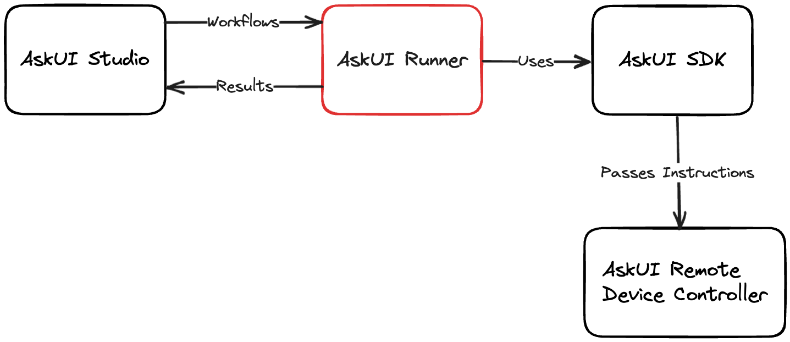

# askui-runner

Runner for Workflows Defined in AskUI Studio.

<p align="center">
  
</p>

## Table of Contents

- [Requirements](#requirements)
- [Installation](#installation)
- [Usage](#usage)
- [Contributing](#contributing)
- [License](#license)


## Requirements

- Python 3.10 or higher
- Node.js 16 or higher

## Installation

We recommend using a virtual environment for Python. Make sure `python --version` returns 3.10 or higher:

```bash
python -m venv venv
source venv/bin/activate
```

We have not yet published the AskUI Runner to PyPI. For now, you can install it directly from GitHub:

```bash
pip install git+https://github.com/askui/askui-runner.git
```

Currently, the standard logging output of the AskUI runner is minimal - we are soon going to change that. But you should see the runner starting the running of workflows as soon as you schedule some runs through the AskUI Studio.

## Usage

Create a configuration file (`.y{a}ml` or `.json`) in a directory of your choosing. The configuration file should contain at least some credentials and the command with which you start the runner without the config file flag:

```yml
runner:
  exec: python -m askui_runner # update if your command is different
  tags: [<tag 1>, <tag 2>, ..] # replace with your own runner tags
queue:
  api_url: https://workspaces.askui.com/api/v1/runner-jobs
  credentials:
    workspace_id: <workspace id> # replace with your workspace id
    access_token: <access token> # replace with your access token
```

See [Generating up-to-date Configuration Schema](#generating-up-to-date-configuration-schema)

Start the runner using

```bash
python -m askui_runner start -c <path to your config file, e.g., askui-runner.config.yaml>
```

## Start UiController

If you want to run your workflows on the same system as the runner you need to start an UiController that listens on port `6769`. Please download the one for your operating system and start it:

* For Windows please your our AskUI Installer: [Windows Getting Started](https://docs.askui.com/docs/general/Getting%20Started/Installing%20AskUI/getting-started)
* [Linux](https://files.askui.com/releases/askui-ui-controller/latest/linux/x64/askui-ui-controller.AppImage)

> ℹ️ **macOS** After installation to `Applications` remove the quarantine flag with the following command run from a terminal: `xattr -d com.apple.quarantine /Applications/askui-ui-controller.app`

* [macOS(intel)](https://files.askui.com/releases/askui-ui-controller/latest/darwin/x64/askui-ui-controller.dmg)
* [macOS(silicon)](https://files.askui.com/releases/askui-ui-controller/latest/darwin/arm64/askui-ui-controller.dmg)

### Execute Workflows on a Remote System: Change UiController URL

You can change the UiController-URL so the runner can talk to a UiController that runs on a remote machine or on a different port:

```yml
...
runner:
  ...
  controller:
    host: "127.0.0.1"
    port: 7000
```

## Generating up-to-date Configuration Schema

Requirements:
- [PDM](https://pdm.fming.dev/latest/) 2.8 or higher for contributing and creating the JSON schema of the config

Find out about all configuration options by taking a look at the JSON schema of the configuration. You can generate an up-to-date JSON schema by cloning this repository and running the following commands.

```bash
## Install and initialize pdm
pip install pdm
pdm install

pdm run python -m scripts.generate_config_schema_json
```

## Contributing

Pull requests are welcome. For major changes, please open an issue first to discuss what you would like to change.

1. Fork the repository.
2. Create a new branch: `git checkout -b your-feature-name`
3. Commit your changes: `git commit -am 'Add some feature'`
4. Push the branch: `git push origin your-feature-name`
5. Submit a pull request.

## License

This project is licensed under the Apache License 2.0 - see the [LICENSE](LICENSE) file for details.
